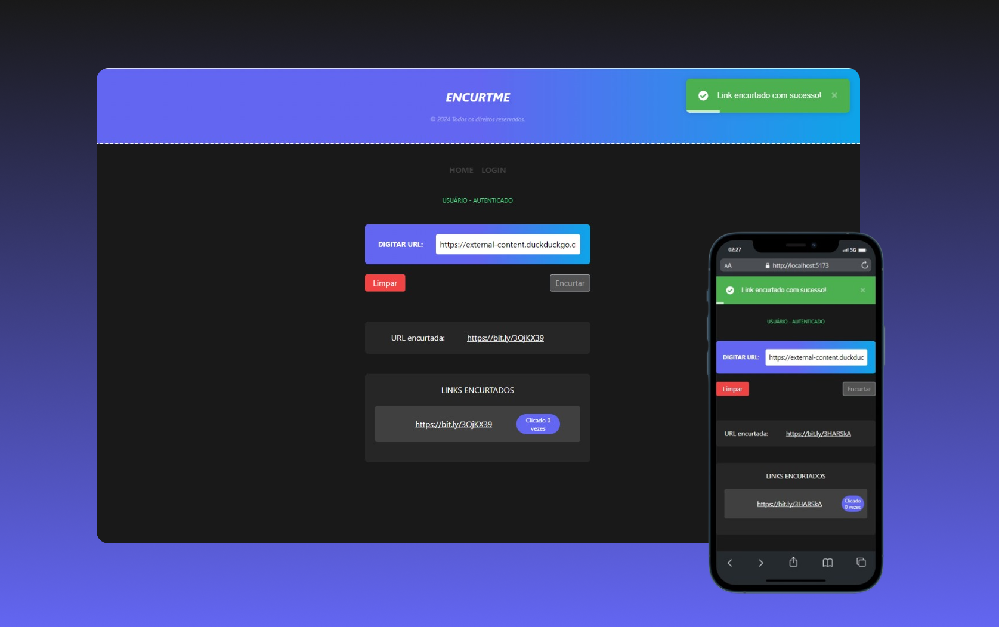

# encurtme

#### Projeto desenvolvido com à finalidade de encurtar links extensos.



## UTILIZANDO O PROJETO

#### node v18.19.0
#### npm v10.2.3

### Bibliotecas instaladas.
- vue-toastification.
- tailwind-css.
- animate.css.
- axios.
- https://app.bitly.com/settings/api (api para o encurtador). Existe um limite de 12 requisições para o `POST`. Caso o encurtador não funcione, basta criar uma conta, ir neste caminho da URL e clicar em `Generate Token`. Após isso, basta substituir o valor do campo `VITE_TOKEN`, localizado no `.env`.

## Configuração do Projeto

##### Clone SSH
```sh
git@github.com:leocastroz/encurtme.git
```

##### Instalação
```sh
npm install
```

##### Compilar e recarregar

```sh
npm run dev
```

##### Compilar e minimizar

```sh
npm run build
```

##### Para este projeto e nescessário o código fonte do Laravel, pois foi feito um JWT <a href="https://github.com/leocastroz/encurtme-api">repositório back-end</a>.

##### Caso sinta à necessidade de ajuda com projeto, para preparar seu ambiente, me chame no LinkedIn <a href="https://www.linkedin.com/in/leoscastro/">Leonardo Castro</a>.
